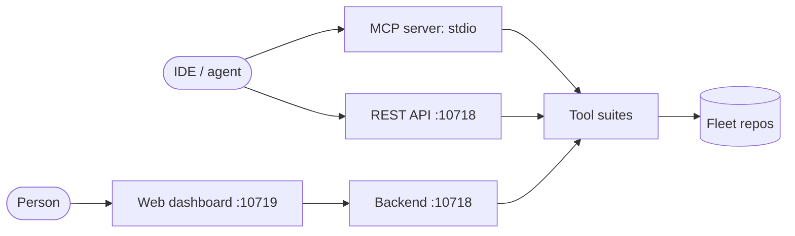

# meta-hypertools

> Build, study, check, and run MCP servers - from one place.

Meta-hypertools operates a fleet of MCP servers. It scaffolds new ones,
studies existing GitHub repos for ideas, checks fleet health against shared
standards, and runs day-to-day operations. Two doors in:

- **You are a person** - open the web dashboard (`start.ps1`, then
  http://127.0.0.1:10719). Click through Builders, Analysis, Fleet Ops,
  Repo Inspiration, and Chat - no config files needed.
- **You are an AI assistant or IDE** - connect the MCP server over stdio
  (dozens of tools across 16 portmanteau operations) or call the REST API on
  port 10718. Start at [llms.txt](llms.txt).

<p align="center">
  <a href="https://github.com/casey/just"></a>
  <a href="https://github.com/astral-sh/ruff"></a>
  <a href="https://biomejs.dev/"></a>
  <a href="https://python.org"></a>
  <a href="https://github.com/PrefectHQ/fastmcp"></a>
  <a href="LICENSE"></a>
  <a href="https://github.com/sandraschi/meta-hypertools/releases"></a>
</p>

**Stack:** Python 3.12+ - [FastMCP](https://github.com/jlowin/fastmcp) 3.4+ - FastAPI - React/Vite - Tailwind

---

## How it fits together



One backend serves all three surfaces. The dashboard calls the same REST
endpoints and the same tool suites an agent calls over MCP - nothing in the
UI is a mock of something else.

---

## Quick start

```powershell
git clone https://github.com/sandraschi/meta-hypertools.git
cd meta-mcp
uv sync --group dev
.\start.ps1
```

| Surface | Address | For |
|---------|---------|-----|
| Dashboard | http://127.0.0.1:10719 | People - point and click |
| REST API | http://127.0.0.1:10718 | Scripts, other services |
| MCP stdio | `uv run meta-mcp-server` in client config | Claude Desktop, Cursor, other IDEs |

Full install paths (per-IDE config, MCPB bundle, troubleshooting):
[INSTALL.md](INSTALL.md).

---

## Desktop app (Windows installer)

Prefer a double-click install over the dev stack: download
`Meta Hypertools_0.5.1_x64-setup.exe` from
[Releases](https://github.com/sandraschi/meta-hypertools/releases), run it,
launch Meta Hypertools. Bundled backend serves `http://127.0.0.1:11220`
(dedicated operator port, clear of the 10718 dev backend) while the app
runs; first launch seeds `.env` from the bundled example.
Details and build log: [docs/TAURI.md](docs/TAURI.md),
[BUILD_LOG.md](BUILD_LOG.md).

---

## What you can do with it

Pick your mission in [docs/WORKFLOWS.md](docs/WORKFLOWS.md) - build things,
learn from other repos, certify releases, operate the fleet. Every row names
the dashboard page and the matching MCP tool.

---

## Reading ladder

Read as deep as you need:

| Level | Doc | What you get |
|-------|-----|--------------|
| L1 - 30 seconds | This README | What it is, both doors, quick start |
| L2 - 5 minutes | [docs/README.md](docs/README.md) | The tour: suites, dashboard, probes, workflows |
| L3 - missions | [docs/WORKFLOWS.md](docs/WORKFLOWS.md) | Task tables: build, learn, certify, operate |
| L4 - tool reference | [docs/TOOLS.md](docs/TOOLS.md) + `docs/tools/*.md` | Every tool, operation, and example |
| L5 - architecture | [docs/ARCHITECTURE.md](docs/ARCHITECTURE.md) | Server, API, MCP, UI internals |
| L6 - fleet health | [docs/fleet/](docs/fleet/) | Probe architecture, cold-install phases |
| L7 - scripts | [scripts/README.md](scripts/README.md) | Every build script, with help entry points |

Agent context files: [llms.txt](llms.txt) (index), [llms-full.txt](llms-full.txt)
(full tool surface), [PRD.md](PRD.md) (direction).

---

## Status and health

No claimed badges here - run the checks yourself:

```powershell
just test    # pytest suite
just lint    # ruff check + format
just health  # standards self-audit
```

---

## Credits

Repo-study workflow adapted from [Repomuse](https://www.npmjs.com/package/repomuse)
(MIT, praveene3127). Harness methodology adapted from
[CLI-Anything](https://github.com/HKUDS/CLI-Anything) (HKUDS, Apache 2.0).

## License

MIT - see [LICENSE](LICENSE).
