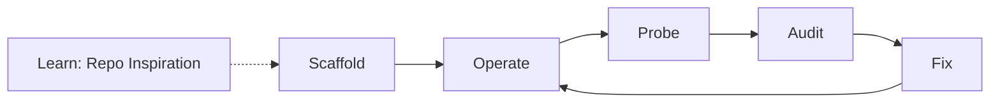

# Workflows - what you do with meta-hypertools

Pick your mission. Every row names the dashboard page and the matching MCP
tool. Tool details live in [TOOLS.md](TOOLS.md) and `tools/*.md`.

## Build things

| You want... | Do this | In one line |
|-------------|---------|-------------|
| A new MCP server, standards-ready | `scaffold_ops(operation="mcp_server")` or dashboard Builders | Full repo in one pass - pyproject, uv.lock, llms.txt, glama, CI, MCPB layout |
| A fullstack webapp with backend | `scaffold_app_fullstack` or `scripts/fullstack-builder.ps1` | Monolith generator emits a complete app: roster, shop, onboarding, chat, scheduler, Tauri wrapper |
| A landing page | `scaffold_ops(operation="landing_page")` | Tailwind marketing scaffold |
| A spec-kit project | `scaffold_ops(operation="spec_kit")` | Spec-Driven Development with agent slash commands |
| A webshop / game / wisdom tree | `scaffold_ops(operation="webshop"\|"game"\|"wisdom_tree")` | Specialized templates |

Docs: [tools/scaffolding.md](tools/scaffolding.md)

## Learn from others

| You want... | Do this | In one line |
|-------------|---------|-------------|
| To study any GitHub repo without cloning | `inspire_repo(operation="structure\|files\|patterns")` | Architecture study: tree, README, topics, patterns |
| A deep agentic architecture review | `inspire_repo_workflow(goal=...)` | Multi-step reasoning plus a scaffold recommendation |
| To wrap your script collection as MCP | `harness_analyze` then `harness_generate` then `harness_refine` | AST spec in, FastMCP server out, gaps checked |

Docs: [tools/repo-inspiration.md](tools/repo-inspiration.md),
[tools/harness-generation.md](tools/harness-generation.md)

## Certify and guard

| You want... | Do this | In one line |
|-------------|---------|-------------|
| To know which repos decayed | `analysis_ops(operation="runts")` | 40+ rules, P0/P1/P2 remediation, scored report |
| To verify releases actually boot | `fleet_startup_probe` | Cold-start probe: start.ps1, health, dirty logs |
| To validate install paths | `fleet_cold_install_probe` | INSTALL.md, .mcpb assets, per-IDE stdio smoke |
| To scrub Unicode from loggers | `diagnostics_ops(operation="unicode")` | EmojiBuster - Windows loggers stay ASCII |
| To scrub PowerShell Linux-isms | `diagnostics_ops(operation="pwsh")` | No grep/tail/&& in fleet scripts |
| To audit the repo's own honesty | `diagnostics_ops(operation="audit_impl")` | Stubs, mocks, TODO placeholders |

Docs: [tools/analysis.md](tools/analysis.md),
[tools/diagnostics.md](tools/diagnostics.md),
[fleet/FLEET_PROBE_ARCHITECTURE.md](fleet/FLEET_PROBE_ARCHITECTURE.md)

## Operate the machine

| You want... | Do this | In one line |
|-------------|---------|-------------|
| Servers registered in all IDEs | `server_ops` | list/register/status/remove with backups |
| Scheduled background jobs | `scheduler_ops` | add/list/run_now/pause/resume/remove |
| Toolchain presets | `toolchain_ops` | one apply switches the whole IDE config |
| Machine health | `heartbeat_ops` | status/processes/ports in the fleet range |
| A repo packed for LLM context | `pack_ops` | single bundle plus token estimate |
| Token budgeting | `token_ops` | per-file/repo estimates before embedding |
| Fleet discovery | `discovery_ops` | local servers plus IDE audit |

## Combined moves

| You want... | Do this | Notes |
|-------------|---------|-------|
| The fleet checked regularly | schedule `analysis_ops(operation="runts")` via `scheduler_ops` | Runs on your interval, unattended |
| A server inspired by a repo you like | `inspire_repo_workflow` then `scaffold_mcp_server` | Two calls: study, then scaffold |
| Existing code exposed to Claude | `harness_analyze` then `harness_generate` | Three calls total with refine |
| To verify it all still works | `just health`, `just test`, `just mcpb-pack` | Self-audit, tests, bundle gate |
