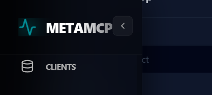

# Fullstack App Builder - `scaffold_ops(operation="fullstack")` + the monolith

The webapp maker. A React 18 + Vite + Tailwind + Bun frontend paired with
a FastMCP 3.4 backend - plus, in the PowerShell monolith, a complete
50-file application in one pass.

## The two entry points

| Entry | What it is |
|-------|------------|
| `scaffold_ops(operation="fullstack", config={...})` | MCP/dashboard path; `config` dict required |
| `scripts/fullstack-builder.ps1` | The 2768-line monolith - flags instead of dicts, the same output, plus feature blocks |

## The monolith deep-dive

```powershell
pwsh scripts/fullstack-builder.ps1 -?                    # full help
pwsh scripts/fullstack-builder.ps1 -AppName my-app       # defaults on
pwsh scripts/fullstack-builder.ps1 -AppName my-app -Interactive
pwsh scripts/fullstack-builder.ps1 -AppName my-app -IncludeTauri -IncludeVoice
```

### Flags

| Flag | What it adds | Default |
|------|--------------|---------|
| `-AppName` | Required. Lowercase hyphenated, 2-30 chars (`^[a-z][a-z0-9-]{2,29}$`). Becomes dir + Python package | - |
| `-Interactive` | 11-toggle feature menu | off |
| `-IncludeAI` | Local LLM chat (Ollama/LM Studio/vLLM probe, skill-first preprompt) | on |
| `-IncludeMCP` | MCP streamable HTTP endpoint `/mcp` | on |
| `-IncludeScheduler` | APScheduler jobs + `patrol` demo job + Jobs page | on |
| `-IncludeCI` | GitHub Actions workflow | on |
| `-IncludeTesting` | pytest + Playwright e2e | on |
| `-IncludeFileUpload` | Upload endpoint + UI | off |
| `-IncludeVoice` | Web Speech TTS/STT | off |
| `-IncludePWA` | Manifest + service worker | off |
| `-IncludeEmail` | SMTP contact endpoint | off |
| `-IncludeRealtime` | WebSocket echo channel | off |
| `-IncludeTauri` | Tauri 2.0 wrapper scaffold (`native/`) | off |
| `-BackendPort` / `-FrontendPort` | Adjacent fleet ports | 10700/10701 |

### What the monolith emits (50 files)

```
my-app/
├── pyproject.toml / uv.lock / justfile / .gitignore / .env.example
├── README.md / llms.txt / llms-full.txt
├── src/my_app/
│   ├── server.py          # FastMCP 3.4 + FastAPI (CORS, health, tools,
│   │                      #   skills, logs ring buffer, jobs, members,
│   │                      #   products/orders endpoints)
│   ├── db.py              # SQLite: members, products, orders
│   └── skills/my_app/SKILL.md
├── webapp/                # React 18 + Vite + Tailwind + Bun
│   ├── src/pages/         # Dashboard, Tools, Skills, Chat, Members, Shop,
│   │                      #   Cart, Jobs, Logs, ApiDocs, Onboarding,
│   │                      #   Settings, Help
│   ├── src/store/         # zustand: llm provider, cart
│   ├── src/lib/           # api, provider probe, speech
│   └── e2e/fleet-audit.spec.ts
├── tests/test_server.py
├── start.ps1 / start.bat  # port clearing + auto-open browser
└── .github/workflows/ci.yml
```

The generated backend endpoints: `/api/health`, `/api/v1/diagnostics`,
`/api/tools`, `/api/skills`, `/skill/{name}`, `/api/logs` (ring buffer),
`/api/jobs` + `/api/jobs/{id}/run` (scheduler), `/api/members` CRUD,
`/api/products`, `/api/orders`, `/mcp` (streamable), `/docs` (Swagger).

### Dashboard form


*The Builders page fullstack form: Project Name + Output Path.*

## Dogfood proof

`benny-the-dog-mcp` was built with the monolith, then extended with a
6-step dog onboarding (bio, pics, vet history, behaviour, walking
schedule, park/fountain coords) and a `dog_ops` portmanteau - the
patrol scheduler job that ships with every app already checks on him.

## Limits

- **`config` required** via MCP; the monolith validates AppName regex and
  port adjacency - both fail loudly, never silently.
- **`-AppName` collision**: target directory must not exist.
- **No auth baked in** - the generated app is local-first; add
  auth middleware for anything exposed beyond localhost.
- **Scheduler is env-gated** (`ENABLE_SCHEDULER`, default matches
  `-IncludeScheduler`); flipping the env var toggles the jobs API.
- **Chat needs a local LLM** - without Ollama/LM Studio the chat page
  shows a disabled provider state (honest, not fake).
- **`bun install` + `uv sync` required before start.ps1** (README says so;
  the generated tests need `pythonpath=src` which the template now ships).
- **The monolith is 2768 lines** - intentional. Do not refactor it. It is
  the joke, and the joke works.
